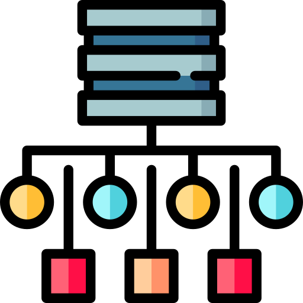

  <h1>Table of Contents</h1>
  <ol>
    <li><a href="#who-am-i">👨🏻‍💻 Who am I?</a></li>
    <li><a href="#interests">🚀 Interests</a></li>
    <li><a href="#gaming">🎮 Gaming</a></li>
    <li><a href="#github-stats">📊 GitHub Stats</a></li>
    <li><a href="#tech-stack">💻 Tech Stack</a></li>
    <li><a href="#random-dev-meme">😂 Random Dev Meme</a></li>
  </ol>

&nbsp;

<h1 align="center" id="who-am-i">
 👨🏻‍💻 Who am I?

 
<a href="https://paypal.me/yjumaah">

</a>
 </h1>

<h3 align="center">Hello! 👋 I'm YassaaaTU, a passionate developer based in Berlin, Germany. Here's a bit about me:</h3>

<h2 align="center" id="interests">🚀 Interests</h2>

<ul>
  <li><strong>Frontend Development</strong>: I love creating beautiful and user-friendly interfaces. HTML, CSS, and JavaScript are my playground.</li>
  <li><strong>Backend Web Development</strong>: I enjoy building robust server-side applications. APIs, databases, and server logic are my jam.</li>
  <li><strong>App Development</strong>: I'm also diving into the world of app development! Whether it's iOS, Android, or cross-platform, I'm excited to explore mobile app technologies.</li>
  <li><strong>Game Development</strong>: Unity3D is my current focus, and I'm eager to learn more about creating immersive gaming experiences.</li>
  <li><strong>Video Editing</strong>: When I'm not coding, you'll find me editing videos. I enjoy bringing stories to life through visuals.</li>
  <li><strong>UI/UX Design</strong>: Good design enhances user experiences. I can create sleek UI elements and design eye-catching visuals.</li>
</ul>

<h2 align="center" id="gaming">🎮 Gaming</h2>

In my free time, I'm an avid gamer. Whether it's exploring virtual worlds, solving puzzles, or competing in multiplayer games, I'm always up for a gaming session

&nbsp;

<h2 align="center" id="github-stats">📊 GitHub Stats</h2>

&nbsp;

&nbsp;

&nbsp;

&nbsp;

<h1 align="center" id="tech-stack">💻 Tech Stack</h1>

<h3 align="center"> 

Languages:</h3>

<h3 align="center">🚀 Frameworks & Libraries:</h3>

<h3 align="center">🛠️ Developer Tools:</h3>

<h3 align="center">

Hosting/SaaS:</h3>

<h3 align="center">🌐 Web Servers:</h3>

<h3 align="center">🛢️ Databases:</h3>

<h3 align="center">🎨 Design Tools:</h3>

<h3 align="center">🔧 IDEs:</h3>

<h3 align="center">📚 Documentation:</h3>

<h3 align="center"><?xml version="1.0" encoding="iso-8859-1"?>
<svg version="1.1" id="Layer_1" xmlns="http://www.w3.org/2000/svg" xmlns:xlink="http://www.w3.org/1999/xlink" 
	 width="16px" height="16px" viewBox="0 0 480 480" xml:space="preserve">
<path style="fill:#32BEA6;" d="M381.744,480H98.256C79.424,480,64,464.576,64,445.744V34.256C64,15.424,79.424,0,98.256,0h283.488
	C400.576,0,416,15.424,416,34.256v411.488C416,464.576,400.576,480,381.744,480z"/>
<g>
	<polygon style="fill:#FFFFFF;" points="155.968,121.2 117.136,94.16 126.304,81.04 152,98.944 185.408,51.248 198.496,60.416 	"/>
	<rect x="240" y="74.96" style="fill:#FFFFFF;" width="122" height="16"/>
	<rect x="240" y="179.648" style="fill:#FFFFFF;" width="122" height="16"/>
	<rect x="240" y="284.336" style="fill:#FFFFFF;" width="122" height="16"/>
	<rect x="240" y="389.04" style="fill:#FFFFFF;" width="122" height="16"/>
	<path style="fill:#FFFFFF;" d="M154.32,324.464c-17.712,0-32.128-14.4-32.128-32.128c0-17.696,14.4-32.112,32.128-32.112
		c17.696,0,32.112,14.4,32.112,32.112C186.416,310.064,172.016,324.464,154.32,324.464z M154.32,276.24
		c-8.896,0-16.128,7.232-16.128,16.112c0,8.896,7.232,16.128,16.128,16.128c8.88,0,16.112-7.232,16.112-16.128
		C170.416,283.472,163.184,276.24,154.32,276.24z"/>
	<path style="fill:#FFFFFF;" d="M154.32,219.76c-17.712,0-32.128-14.4-32.128-32.112s14.4-32.112,32.128-32.112
		c17.696,0,32.112,14.4,32.112,32.112S172.016,219.76,154.32,219.76z M154.32,171.536c-8.896,0-16.128,7.232-16.128,16.112
		s7.232,16.112,16.128,16.112c8.88,0,16.112-7.232,16.112-16.112S163.184,171.536,154.32,171.536z"/>
	<path style="fill:#FFFFFF;" d="M154.32,429.152c-17.712,0-32.128-14.4-32.128-32.112s14.4-32.112,32.128-32.112
		c17.696,0,32.112,14.4,32.112,32.112S172.016,429.152,154.32,429.152z M154.32,380.944c-8.896,0-16.128,7.232-16.128,16.112
		s7.232,16.112,16.128,16.112c8.88,0,16.112-7.232,16.112-16.112S163.184,380.944,154.32,380.944z"/>
</g>
</svg> Next on my list to learn/get acquainted with:</h3>

&nbsp;

<h3 align="center" id="random-dev-meme">😂 Random Dev Meme</h3>

---

&nbsp;

	

<!-- Proudly created with GPRM ( https://gprm.itsvg.in ) | only used as a template then customized bymyself-->
